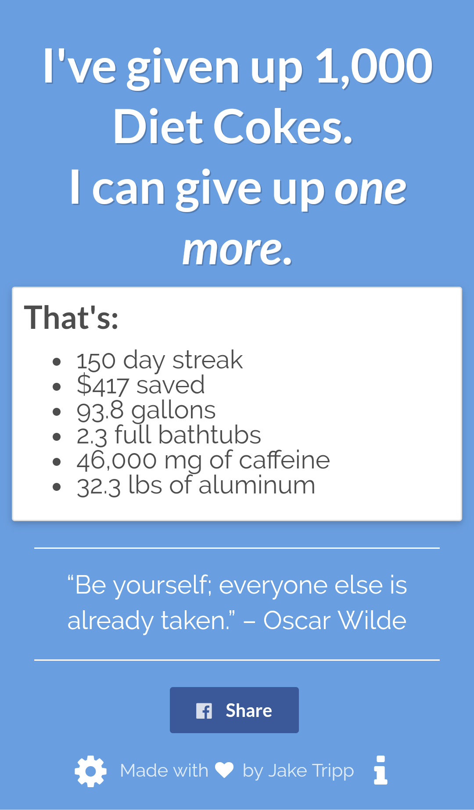
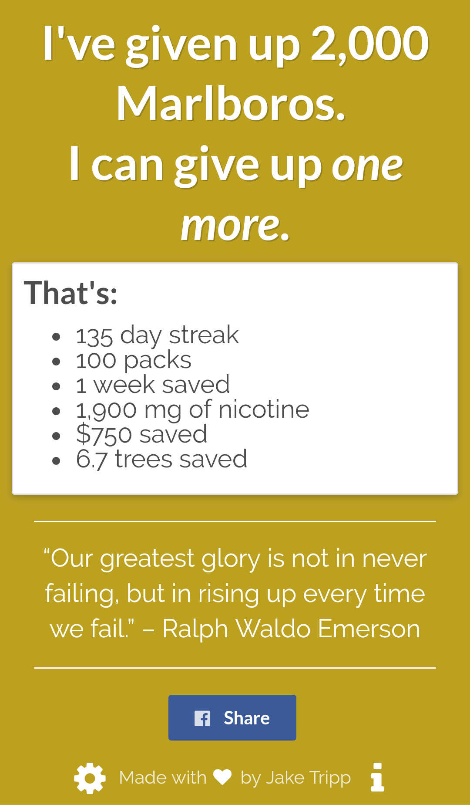

# Motivation Stats
#### Written in JavaScript, HTML, and CSS.
#### Libaries: Semantic UI, jQuery, jQuery UI, Modernizr, Sweet Alert

### [Check out Motivation Stats](http://www.motivationstats.com "Motivation Stats")   

- - - - 

### What's it do:
* Motivation Stats provides a helpful way to track the statistics of a life after soda and cigarettes. 

### Who's it for:
* Motivation Stats is a great tool for anyone wanting to give up soda or cigarettes that needs an extra nudge. It's also great for people that have already quit that just want to see how far they've come. 

### What stats does it show:
| Sodas        | Cigarettes  | Both  	   |
| :-----------:|:-----------:| :----------:|
| gallons      | packs 	     | days since  | 
| bathtubs     | time saved  | # given up  |
| mgs caffeine | mg nicotine | money saved |
| lbs sugar    | trees saved |             |
| lbs aluminum | 		     |     	       |

### localStorage:
* I decided to use something called localStorage - meaning there's no database (your info is stored in your personal device only). The good news is you don't have to sign up for anything, give me your email, or create & remember a password. But this also means that you will have to enter your info on any device you want to access this site on (for example, your phone and your laptop).
* The most important info for your stats is the date you quit. I suggest that you fill out the settings page, take a screenshot, and email it to yourself (or just write the date down somewhere). If anything happens, you'll always know the date you quit.

### Troubleshooting:
1. don't use incognito mode
2. enable cookies
3. enable JavaScript
4. Clear localStorage (see about page)
5. <a href="https://www.linkedin.com/in/jake-tripp/" target="_blank">message me on linkedin</a> 

### Why I made it:
* My mom was addicted to Diet Coke for most of her adult life. She tried multiple times to quit - all unsuccessful. She drank, on average, six Diet Cokes a day. She quit on February 23, 2017.
* Now, she has lower cholesterol and blood pressure, healthier body weight and dental hygiene, more balanced emotional health, and less pain. I want that for everyone.

### "Only soda and cigarettes"
* I considered expanding this app to include other vices but I settled on just soda and cigarettes because I think they are quite habitual. For things like alcohol, candy, and coffee, I think varieties and amounts vary too much for most people for the stats to be meaningful and accurate.

### Info Used
* 40 gallons = 1 bathtub (they vary, I measured mine)
* <a href="http://recycleusainc.com/aluminium-cans/how-many-aluminum-cans-equal-1-pound/" target="_blank">31 cans = 1 lb aluminum</a>
* <a href="http://www.cnn.com/2017/05/31/health/tobacco-environment-who-report/" target="_blank">300 cigarettes = 1 tree</a>
* <a href="https://academic.oup.com/ntr/article/15/1/255/1112360/Determination-of-Nicotine-Absorption-from-Multiple" target="_blank">0.95 mg nicotine absorbed per cigarette</a>
* <a href="https://www.iso.org/iso-8601-date-and-time-format.html" target="_blank">ISO 8601 time</a>
* <a href="https://www.addiction.com/7215/70-best-quotes-for-addiction-recovery/" target="_blank">Quotes</a>
* <a href="https://www.caffeineinformer.com/the-caffeine-database" target="_blank">Caffeine Informer (caffeine and sugar content)</a>

### Acknowledgments
I'd like to thank my friends &amp; family for letting me test Motivation Stats with them. I'd also like to thank the photographers whose photos I used: <a target="_blank" title="Ashley Knedler" href="https://unsplash.com/@aknedler">Ashley</a>, <a target="_blank" title="Braden Collum" href="https://unsplash.com/@bradencollum">Braden</a>, <a target="_blank" title="Aneta Ivanova" href="https://unsplash.com/@anetaivanova">Aneta</a>, <a target="_blank" title="Joshua Earle" href="https://unsplash.com/@joshuaearle">Joshua</a>, <a target="_blank" title="Todd Quackenbush" href="https://unsplash.com/@toddquackenbush">Todd</a>, and <a target="_blank" title="Jared Erondu" href="https://unsplash.com/@erondu">Jared</a>. Finally, I'd like to give special thanks to <a href="http://lizzienguyen.com/" target="_blank" title="Lizzie Nguy&#7877;n">Lizzie Nguy&#7877;n</a> for doing the logo.

### Share and Donate:
* If you love this website, please share it! Especially if you or someone you know could benefit from it!
* And for some good karma, [send a donation my way](https://www.paypal.com/us/home). I'd thoroughly appreciate it.

- - - - 

### Screenshots:

Soda             |  Cigarettes
:-------------------------:|:-------------------------:
  |  

- - - - 

